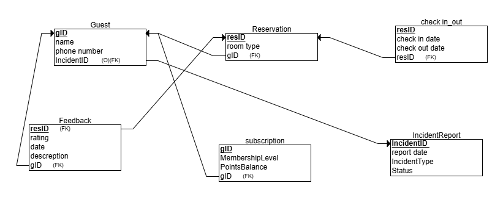
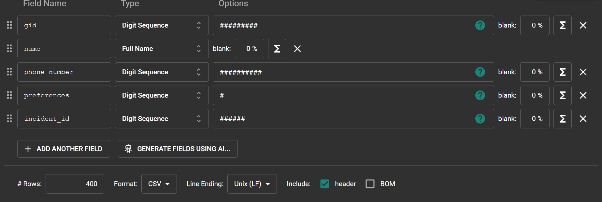
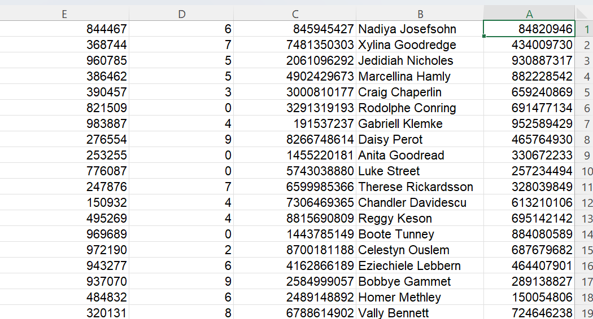
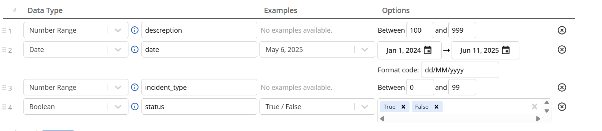
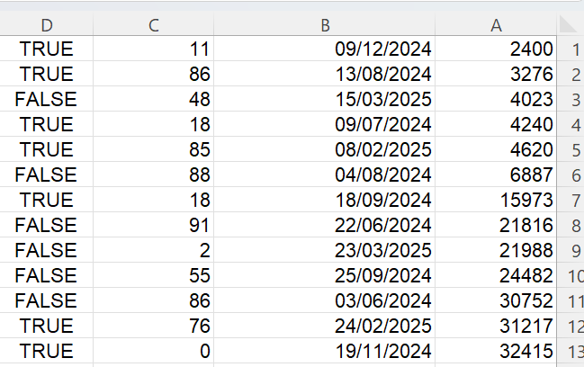
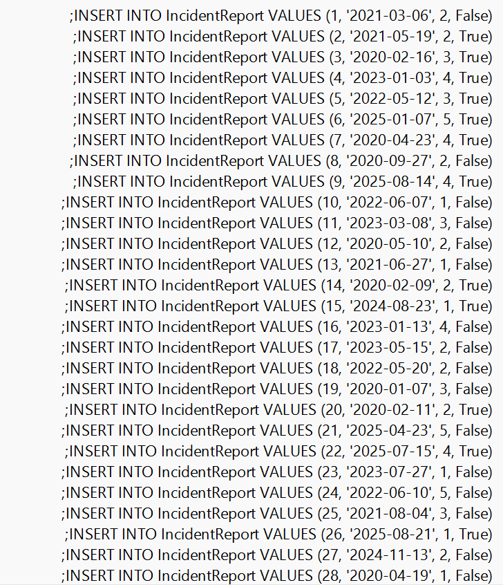

**Hotel Management System - README**

**Submitted by:** Ohad Kahlon and Meir Revivo\
**System Component:** Guests management.

**Table of Contents**

1.  Introduction

2.  Entity-Relationship Diagram (ERD)

3.  Data Structure Diagram (DSD)

4.  Design Decisions

5.  Data Input Methods

6.  Backup and Restore Procedures

7.  Screenshots

**Introduction**

The Hotel Management System is designed to store and manage
guest-related data efficiently. It provides functionalities such as
guest check-in and check-out, room assignments, billing, and service
requests. The goal of the system is to streamline hotel operations and
enhance customer service.

**Entity-Relationship Diagram (ERD)**

**Data Structure Diagram (DSD)**

**Data**

> **First tool: using [mockaro](https://www.mockaroo.com/) to create csv
> file**
>
> **Entering a data to guest table:**
>
> 
>
> 
>
> **Second tool:
> using [generatedata](https://generatedata.com/generator). to create
> csv file**
>
> **Entering a data to incidentType table:**
>
> 
> 
>
> **Third tool: using python to create csv file**
>
> **Part of Python code:**
>
> 
>
> **Sql file made from the python script:**
>
> 
>
> **Backup**

-   **backups files are kept with the date of the backup:**

> 
