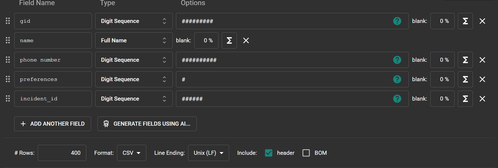
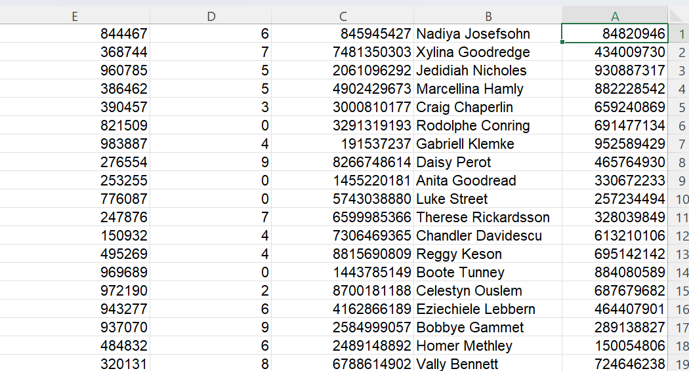
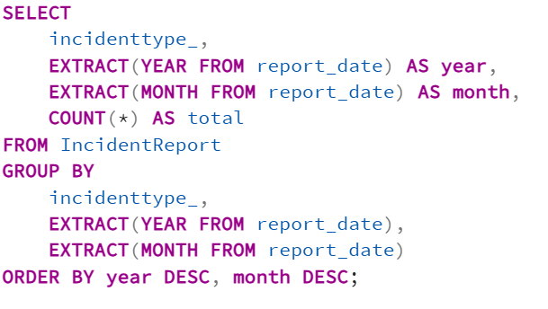
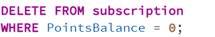
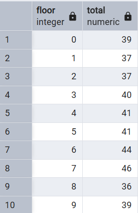
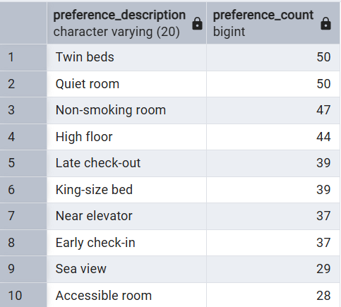

**Hotel Management System - README**

**מגישים: אוהד כחלון ומאיר רביבו**\
**היחידה הנבחרת: ניהול אורחים**

**תוכן העניינים**

שלב א\' - יצירת מסד הנתונים

1.  מבוא

2.  Entity-Relationship Diagram (ERD)

3.  Data Structure Diagram (DSD)

4.  שיטות להכנסת נתונים

5.  Backup and Restore

שלב ב\' - שאילתות בסיסיות ומתקדמות

6.  Queries

7.  Constraints

8.  Rollback and Commit

שלב ג\' - אינטגרציה

9.  תרשימי DSD ו־ERD - צילומי מסך

10. הסבר על החלטות בתהליך האינטגרציה

11. תהליך האינטגרציה - הסבר מילולי עם פקודות

12. מבטים (Views)

13. תיאור כל מבט

14. פלט של כל מבט

15. שאילתות על מבטים

16. הסבר מילולי של כל שאילתא

17. קוד SQL

18. פלט שאילתא

שלב ד\' - פונקציות, פרוצדורות וטריגרים:

19. עבור כל תוכנית (פונקציה / פרוצדורה / טריגר):

20. תיאור מילולי של מטרת הקוד

21. קוד מלא של הפונקציה / הפרוצדורה / הטריגר

22. צילום מסך של ההפעלה

שלב ה\' - ממשק גרפי:

23. הוראות הפעלה של האפליקציה

24. הסבר על דרך העבודה

25. מסכים עיקריים במערכת

26. צילומי מסך מכל אחד מהמסכים בפעולה

**מבוא:**

מערכת ניהול המלון שבנינו נועדה לנהל בצורה יעילה ומרוכזת את המידע
והתהליכים הקשורים לאורחי המלון. המערכת כוללת מגוון רכיבים שמכסים את
התחומים המרכזיים של פעילות המלון: ניהול אורחים, תלונות, פידבקים
והזמנות.

באמצעות הממשק הגרפי שפותח, ניתן לבצע פעולות כמו הוספה ומחיקה של הזמנות,
בדיקת זמינות חדרים, צפייה בתלונות של אורחים וניהול הטיפול בהן, קבלת
פידבקים והענקת תגמולים לאורחים מרוצים. כל המידע מנוהל בבסיס נתונים
מאורגן, שמבטיח עקביות, שלמות ועדכניות.

המטרה המרכזית של המערכת היא לייעל את תהליך העבודה של צוות הקבלה
והשירות, לאפשר שליטה ובקרה על כל ההיבטים של התקשורת עם האורחים, ולשפר את
שביעות רצונם על ידי תגובה מהירה ויעילה לכל פנייה, הזמנה או
בעיה.

**Entity-Relationship Diagram (ERD)**


**Data Structure Diagram (DSD)**


**Data input methods**

> **First tool: using [mockaro](https://www.mockaroo.com/)o to create
> csv file**
>
> **Entering a data to guest table:**
>
> 
>
> 
>
> **Second tool:
> using [generatedata](https://generatedata.com/generator). to create
> csv file**
>
> **Entering a data to incidentType table:**
>
> 
> 
>
> **Third tool: using python to create csv file**
>
> **Part of Python code:**
>
> 
>
> **Sql file made from the python script:**
>
> 

**Backup**

-   **backups files are kept with the date of the backup:**

> 

**Queries**

> **Select:**

1)  רשימת האורחים שהיו להם תקריות פתוחות, ופרטי התקרית ביחד עם פרטי
    האורח

> 
>
> 

2)  מספר ההזמנות לפי סוג חדר


3)  כל המשובים מתחת לדירוג 3 שנכתבו בחודשים שונים


4)  מספר הלילות שכל אורח שהה במלון


5)  רשימת אורחים עם מנוי ברמה גבוהה מ7


6)  אורחים שהשאירו פידבק על יותר מהזמנה אחת

> 

7)  תאריכי הדיווחים לפי סוג
    התקרית

> 

8)  דירוג ממוצע של פידבק לפי רמת המנוי

> 


**Delete:**

1.  מחיקת כל הפידבקים מתחת לדירוג 2

> 
>
> מסד הנתונים לפני השינוי:
>
> 
>
> מסד הנתונים לאחר השינוי:
>
> 

2.  מחיקת מנויים שאין להם נקודות כלל

> 

מסד הנתונים לפני השינוי:


מסד הנתונים לאחר השינוי:


3.  מחיקת תקריות שנסגרו לפני יותר משנה

> מסד הנתונים לפני השינוי:
>
> 
>
> מסד הנתונים לאחר השינוי:
>
> 

**Update:**

1.  עדכון סטטוס התקריות שגילן מעל חודש לסגורות

> 

מסד הנתונים לפני השינוי:


מסד הנתונים לאחר השינוי:


2.  עדכון דירוג של פידבקים בלי תיאור לדירוג 3

> 
>
> מסד הנתונים לפני השינוי:
>
> 

מסד הנתונים לאחר השינוי:


3.  העלאת רמת המנוי לכל מי שיש לו מעל 80
    נקודות

מסד הנתונים לפני השינוי:


מסד הנתונים לאחר השינוי:


1)  **Constraints:**

    1.  חובה להכניס מספר טלפון לאורח

> 
>
> ניסיון הכנסת נתון שסותר את האילוץ:
>
> 

2.  ברירת מחדל לסטטוס תקרית יהיה \'פתוח\'

> 

ניסיון להכנסת נתונים:


3.  אילוץ שתאריך הכניסה יהיה לפני תאריך היציאה

> 

ניסיון להכנסת נתונים וסתירת האילוץ:


2)  **Rollback and Commit:**


הנתונים לפני הטרנזקציה:


השינוי:


לאחר ROLLBACK:


המצב לפני השינוי:


המצב אחרי השינוי:


המצב לאחר commit:


**שלב 3 -- אינטגרציה:**

קיבלנו מסד נתונים של חדרים והזמנות. טבלת החדרים מקשרת בין מספר חדר לסוג
ולפרטים שלו, וטבלת ההזמנות (כמו טבלת ההזמנות במסד נתונים שלנו), מקשרת
בין מספר הזמנה למספר החדר המוזמן.

במסד נתונים המשותף, נאחד את טבלאות ההזמנות של המסד המקורי ושל המסד
החדש. במסד החדש יש ערך RoomNumber בתוך טבלת ההזמנות, בעוד
במסד שלנו יש ערך RoomType. מכיוון שנוספת במסד המאוחד
טבלת Room שמקשרת בין מסר החדר לבין הסוג שלו, נמחק את
הפרמטר RoomType מטבלת ההזמנות לטובת הערך
RoomNumber.

למסדר המשותף נוסיף את טבלת Room מהמסד החדש, ונקשר אותה
לטבלת ההזמנות הקיימת.

תרשים ERD של מסד הנתונים השני:


תרשים DSD של מסד הנתונים השני:


תרשים ERD של מסד הנתונים
המאוחד:

תרשים DSD של מסד הנתונים המאוחד:


תיאור שינוי מסד הנתונים כולל החלטות ופקודות:

שלב א: הוספת הטבלה Room למסד הנתונים הקיים.


שלב ב: נוסיף לטבלת ההזמנות את העמודה
RoomNumber:


שלב ג: נקשר את טבלת Reservation לטבלת
Room:


שלב ד: מחיקת העמודה room_type מטבלת ההזמנות:


שלב ה: נעתיק את נתוני roomNumber מטבלת room
לטבלת reservation:


**יצירת מבטים:**

מבט 1: מבט של ניהול/תפעול חדרים -- איזה חדרים הוזמנו וכמה
פעמים, כולל סוג החדר והקומה.


נתונים מהמבט:

יצירת שתי שאילתות על המבט:

1.  הצגת כל החדרים עם 0 הזמנות

2.  הצגת סכום ההזמנות לפי קומה, ממוין על פי מספרי הקומות


נתונים מהשאילתות:

1. 

> 

(אין חדרים עם 0 הזמנות בנתונים שלנו)

2.  

החלטנו שצריך להוסיף גם טבלת preferences שתקשר בין מספר
ההעדפה (בטבלת ההזמנות) לתיאור המילולי שלה.


נקשר בינה לבין טבלת reservation:


מבט 2: מבט של ניתוח העדפות אורחים -- מה ההעדפות שנבחרו,
וכמה הזמנות בחרו כל אחת.




יצירת שתי שאילתות על המבט:

1.  ההעדפה הכי פופולרית

2.  כל ההעדפות עם יותר מ־30 הזמנות

```
<!-- -->
```
1)  

> 

2)  

> 

**שלב 4 -- תכנות:**

לפני שהתחלנו את שלב 4, החלטנו שבטבלה subscription,
העמודה membershiplevel צריכה להיות ברמות של זהב, כסף ונחושת
(ולא מספר 0-9 כמו שהיה עד עכשיו). אז יצרנו קובץ
alterTable.sql שעדכן את הערך בטבלה לצורה הנכונה.


בנוסף, נשנה את הערך של roomtype גם לערך מילולי במקום
מספרי:


נבטל את העמודה incidentType בטבלה
incidentreport:


ונוסיף לה עמודת description:


(כל השינויים האלה נמצאים בקובץ alterTable.sql)

**פונקציות:**

1)  **get_guest_feedbacks(p_gid INTEGER):**

> **מטרה:** החזרת כל הפידבקים שניתנו על ידי אורח מסוים לפי
> gid.
>
> **פרמטרים:**p_gid -- מזהה האורח.
>
> **מחזירה:**REFCURSOR שמצביע על כל הדירוגים, התאריכים
> והתיאורים של הפידבקים שכתב האורח.
>
> 

הפעלת הפונקציה על gid =
213517251:


**2)**

**get_available_rooms_by_type(desired_type TEXT,
desired_check_in DATE, desired_check_out DATE)**

**מטרה:** החזרת חדרים זמינים לפי סוג חדר ותאריכים מבוקשים.

**פרמטרים:**desired_type -- סוג החדר (כמו
\"Double\", \"Suite\").

desired_check_in, desired_check_out -- טווח התאריכים.

**מחזירה:** REFCURSOR שמכיל את כל מספרי החדרים
הפנויים.

 

הדפסה עבור Double, תאריך
כניסה היום +3 ויציאה היום +7:

**פרוצדורות:**

1)  **resolve_old_incidents():**

> **מטרה:** סימון תלונות לא פתורות (status = TRUE) שחלפו
> להן 30 ימים כהודעות שפגו תוקף.
>
> **פעולה:** מוסיפה תיאור \Auto-expired: not resolved
> within 30 days\לתלונות ישנות.

 

מסד הנתונים לפני הפעלת
הפרוצדורה:

> מסד הנתונים לאחר הפעלת הפרוצדורה:
>
> 
>
> **2) reward_high_rating_guests():**
>
> **מטרה:** הענקת 10 נקודות בונוס לאורחים שכתבו פידבק עם דירוג של 7
> ומעלה.
>
> **פעולה:** מעדכנת את שדה
> pointsBalance בטבלת subscription.

מסד הנתונים לפני הפעלת הפרוצדורה:


מסד הנתונים לאחר הפעלת הפרוצדורה:


**טריגרים:**

1)  **עדכון דרגת מנוי לפי כמות נקודות**

**מטרה: **ברגע שיתעדכן מספר הנקודות במנוי,
הדרגה (level) תתעדכן בהתאם:

-   0--20 = \"Basic\"

-   21--60 = \"Silver\"

-   \"gold\" = 61 ומעלה.

פונקציית טריגר:

הטריגר:


בדיקה שהטריגר עובד:

ניצור שאילתת UPDATE, שתעדכן את מספר הנקודות של אורח מסוים
למעל הסף של GOLD (כלומר מעל 60), ונבדוק האם ה
membershiplevel שלו השתנה בהתאם.

האורח לפני העדכון:


קוד העדכון:


האורח לאחר העדכון:


2)  **מילוי אוטומטי של תאריך היום הנוכחי בפידבק**

טריגר זה מופעל לפני הכנסת רשומה חדשה לטבלת הפידבקים. אם לא הוזן תאריך
על ידי המשתמש, הטריגר ימלא אוטומטית את שדה התאריך בתאריך של היום
הנוכחי.

פונקציית הטריגר:


הטריגר:


בדיקה שהטריגר עובד:

ניצור שאילתת INSERT שתכניס פידבק חדש, ללא
תאריך.

לפני כן, נוסיף הזמנה חדשה כדי שנוכל לתת עליה פידבק:


לפידבק החדש אין תאריך ולכן לפי הטריגר, התאריך צריך להיות התאריך של היום
(13.7)


**תוכניות ראשיות:**

1)  מפעילה את הפרוצדורה שמעדכנת כל תלונה שעבר לה מעל ל30 יום, ולאחר מכן
    מדפיסה את כל הפידבקים שנכתבו על ידי משתמש מסוים (בדוגמה בקוד פה --
    213517251)**.**

 

> פלט לאחר ההרצה:
>
> 

2)  מפעילה את הפונקציה שנותנת 10 נקודות בונוס למשתמש שנתן דירוג גבוה
    מ7, ולאחר מכן מראה את כל החדרים הפנויים מהסוג שנכתב (בדוגמה
    שלנו, Double), בתאריכים שנבחרו (בדוגמה שלנו, היום +3 עד
    היום+7)


פלט לאחר ההרצה:

> **שלב 5 - יצירת ממשק גרפי לעבודה מול בסיס
> הנתונים :**
>
> לפני שנתחיל את שלב 5, נשנה כמה דברים בטבלאות כדי שהנתונים יהיו
> מסודרים בצורה הגיונית יותר, ונוכל להתמודד איתם בצורה טובה
> יותר.]
>
> נשנה את טבלת check_in_out, כך שהיא תהיה טבלה מקשרת.
> במקום שכל הזמנה בטבלה reservation תכיל gid,
> מספר הלקוח יהיה בתוך הטבלה check_in_out, שתקשר בין הזמנה
> ללקוח.
>
> לשם כך נעשה כמה שלבים:

1)  נוסיף את העמודה gid לטבלה check_in_out,
    ונגדיר שהנתונים שלה מגיעים מטבלת guest.


2)  נעתיק את המידע של gid מטבלת reservation
    לטבלת check_in_out לפי resid
    מתאים:

> 

3)  נמחק את עמודת gid מטבלת
    reservation:

> 

4)  נסמן את עמודת gid כחובה (אי אפשר שתהיה הזמנה ללא
    אורח):

> 

בנוסף, ניצור פרוצדורה חדשה, שכשנרצה להכניס הזמנה חדשה, נצטרך לעבור דרכה
והיא תעדכן גם את טבלת reservation וגם את טבלת
check_in_out, כדי ששתיהן יהיו מעודכנות כמו שצריך ולא יהיו סתירות
וחוסרים במידע.

  []

ונוסיף אלמנט לטבלת reservation, שכאשר נכנסת הזמנה חדשה,
נוצר לה resid סריאלי.


(ביקשנו להתחיל מ9999 כי יש כבר ערכים בטבלה ולכן נמשיך סריאלית מהמספר
הגבוה ביותר שקיים בה כרגע כדי שלא יהיו התנגשויות).

ונוסיף גם פרוצדורה למחיקת הזמנה משתי הטבלאות:


כעת נתחיל בבנייה ועיצוב של הממשק הגרפי:

כל המסכים נבנו בעזרת python ו
TKINTER.

[לפני שהמסך הראשי מתחיל לפעול, בנינו קוד
נפרד (קובץ (db.py לחיבור של המערכת למסדר הנתונים. כל מסך
שצריך לגשת למסד הנתונים, ייבא את הקוד ויתחבר כך למסד
הנתונים.

**הכלים שבהם השתמשנו:**

- Python - שפת הפיתוח העיקרית של המערכת.

- Tkinter - ספריית GUI מובנית
ב־Python ליצירת הממשק הגרפי.

- psycopg2 - ספרייה לחיבור למסד נתונים
PostgreSQL מתוך Python.

- PostgreSQL- מסד הנתונים של המערכת.

- PyCharm - סביבת העבודה שבה פותחה האפליקציה.

**קבצי המערכת ותפקידם**

- \`hotel_app.py\` - המסך הראשי שמרכז את כל הגישה למסכים
האחרים.

- \`reservation_screen.py\` - מסך שמוביל למסכי ניהול
הזמנות.

- \'new_reservation_screen.py\' -- מסך להכנסת הזמנה
חדשה.

- \'delete_reservation_screen.py\' -- מסך למחיקת הזמנה
קיימת.

- \'show_all_reservations.py\' -- מסך להצגת כל ההזמנות
הקיימות.

- \`incidents_screen.py\` - ניהול תלונות: סינון, מחיקה,
עדכון.

- \`feedback_screen.py\` - ניהול פידבקים והפעלת
פרוצדורות.

- \`db.py\` -- קובץ העזר להתחברות למסד
הנתונים.

1)  **מסך ראשי**:

> המסך הראשי הוא המסך ממנו נגיע לכל אחת מהאפשרויות האחרות במערכת. המסך
> הראשי יכלול 3 כפתורים, בהתאם ל3 חלקי הניהול של המערכת:

ניהול הזמנות, ניהול תלונות, וניהול פידבקים.


2)  **מסך ניהול הזמנות:**

לאחר שנלחץ על כפתור \"ניהול הזמנות\", נגיע
למסך שבו יש מספר אפשרויות.

3)  **מסך יצירת הזמנה:**

> במסך יצירת הזמנה, נוכל ליצור הזמנה
> חדשה.
>
> מסך זה משתמש במספר דברים ממס הנתונים שלנו.
>
> לפני שהלקוח בוחר את החדר המועדף עליו, הוא ממלא את סוג החדר, ואת
> תאריכי הכניסה והיציאה, ולאחר מכן לוחץ על \"עדכן רשימת חדרים פנויים\".
> לחיצה על כפתור זה, מפעילה את הפרוצדורה שבנינו בשלב 4
> ((get_available_rooms_by_type, שמחזירה Ref
> Cursor עם מספרי החדרים הפנויים מהסוג הזה בתאריכים שנבחרו.
>
> מכיוון שהטבלה check_in_out היא טבלה מקשרת (בין מספר לקוח
> למספר הזמנה, ומוסיפה לו תאריכי כניסה ויציאה), אז נצטרך לעדכן כל הזמנה
> גם בטבלה reservation וגם בטבלה המקשרת
> check_in_out.
>
> לשם כך השתמשנו בפרוצדורה שבנינו בתחילת השלב הנוכחי
> ((add_reservation_with_guest, שמעדכנת את שתי הטבלאות בכל
> הכנסה.
>
> בנוסף, המערכת תבדוק האם מספר הלקוח קיים בטבלה
> guest.
>
> אם כל המידע נכון והחדר פנוי, המערכת תעדכן את הטבלאות המתאימות במסד
> הנתונים ותיתן הודעת אישור.

4)  **מסך מחיקת הזמנה:**

> גם פה השתמשנו בפרוצדורה שיצרנו בתחילת השלב
> (delete_reservation), שמוחקת את ההזמנה גם
> מטבלת reservation וגם מטבלת check_in_out.
> לאחר לחיצה על כפתור המחיקה, המערכת תשאל את המשתמש \"האם אתה בטוח
> שברצונך למחוק את הזמנה מספר (מספר ההזמנה)?\". כך נמנע טעויות בלתי
> הפיכות בשימוש במסד הנתונים.

5)  **מסך הצגת כל ההזמנות:**

> מפעיל שאילתא שמציגה את כל ההזמנות שיש
> במערכת, כולל סוג החדר, מספר הזמנה, מספר הלקוח, ותאריך כניסה
> ויציאה.

6)  **מסך ניהול תלונות:**

> במסך ניהול התלונות, נוכל לראות את כל התלונות שמופיעות במערכת, מספר
> הלקוח המתלונן, תאריך דיווח וסטטוס.
>
> במסך יש מספר אפשרויות:

-   טען תקריות: מרענן את רשימת התקריות

-   מחק תקריות שקיימות מעל שנה: מפעיל את השאילתא שכתבנו בשלב 2, שמוחקת
    תקריות שהתאריך שלהן הוא למעלה משנה (מכיוון שהשאילתא לא מתאימה במדויק
    למסד נתונים אחרי האינטגרציה והעדכונים, כתבנו אותה מחדש
    בקוד).

-   סגור תקריות פתוחות מעל 30 יום: מפעיל
    את הפרוצדורה משלב 4 ((resolve_old_incidents, שמוסיפה
    הערה בתיאור של כל תלונה שפתוחה מעל 30 יום

7)  **מסך ניהול פידבקים:**

> במסך קיימות מספר אפשרויות:

-   הצגת כל הפידבקים שקיימים במערכת

-   שימוש בשאילתא משלב 2, שמציג את רשימת כל הפידבקים עם דירוג מתחת ל3
    (גם כאן, כתבנו את השאילתא בצורה מעודכנת בתוך הקוד כדי שתתאים במדויק
    לשינויים בפרוייקט)

-   בדיקת פידבקים של אורח -- שימוש בפונקציה שכתבנו בשלב 4
    (get_guest_feedbacks), שמקבלת gid של אורח
    ומחזירה Ref Cursor של כל הפידבקים שהאורח
    כתב.

-   הענקת נקודות בונוס -- שימוש בפרוצדורה שכתבנו בשלב 4
    ((reward_high_rating_guests שמעניקה 10 נקודות בונוס לכל
    לקוח שנתן דירוג שגבוה מ7.


