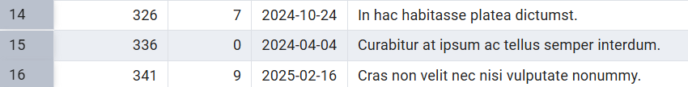
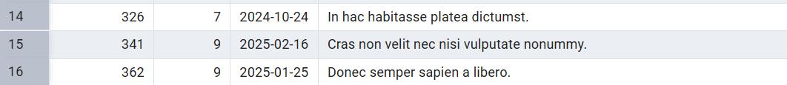

**Hotel Management System - README**

**Submitted by:** Ohad Kahlon and Meir Revivo\
**System Component:** Guests management.

**Table of Contents**

1.  Introduction

2.  Entity-Relationship Diagram (ERD)

3.  Data Structure Diagram (DSD)

4.  Data Input Methods

5.  Backup and Restore Procedures

6.  Queries

7. Constraints

8. Rollback and Commit:

**1) Introduction**

The Hotel Management System is designed to store and manage
guest-related data efficiently. It provides functionalities such as
guest check-in and check-out, room assignments, billing, and service
requests. The goal of the system is to streamline hotel operations and
enhance customer service.

**2) Entity-Relationship Diagram (ERD)**

**3) Data Structure Diagram (DSD)**

**4) Data input methods**

> **First tool: using [mockaro](https://www.mockaroo.com/)o to create
> csv file**
>
> **Entering a data to guest table:**
>
> 
>
> 
>
> **Second tool:
> using [generatedata](https://generatedata.com/generator). to create
> csv file**
>
> **Entering a data to incidentType table:**
>
> 
> 
>
> **Third tool: using python to create csv file**
>
> **Part of Python code:**
>
> 
>
> **Sql file made from the python script:**
>
> 
>
> **5) Backup**

-   **backups files are kept with the date of the backup:**

> 
>
> **6) Queries**
>
> **Select:**

1)  [רשימת האורחים שהיו להם תקריות פתוחות, ופרטי התקרית ביחד עם פרטי
    האורח]{dir="rtl"}

> 
>
> 

2)  [מספר ההזמנות לפי סוג חדר]{dir="rtl"}

3)  [כל המשובים מתחת לדירוג 3 שנכתבו בחודשים שונים]{dir="rtl"}

[]{dir="rtl"}

4)  [מספר הלילות שכל אורח שהה במלון]{dir="rtl"}

5)  [רשימת אורחים עם מנוי ברמה גבוהה מ7]{dir="rtl"}

[]{dir="rtl"}

6)  [אורחים שהשאירו פידבק על יותר מהזמנה אחת]{dir="rtl"}

> 

7)  [תאריכי הדיווחים לפי סוג
    התקרית]{dir="rtl"}

> 

8)  [דירוג ממוצע של פידבק לפי רמת המנוי]{dir="rtl"}

> 

**Delete:**

1.  [מחיקת כל הפידבקים מתחת לדירוג 2]{dir="rtl"}

(images/image26.png)
>
> [מסד הנתונים לפני השינוי:]{dir="rtl"}
>
> 
>
> [מסד הנתונים לאחר השינוי:]{dir="rtl"}
>
> 

2.  [מחיקת מנויים שאין להם נקודות כלל]{dir="rtl"}

> 

[מסד הנתונים לפני השינוי:]{dir="rtl"}

(images/image30.png)

[מסד הנתונים לאחר השינוי:]{dir="rtl"}

(images/image31.png)

3.  [מחיקת תקריות שנסגרו לפני יותר משנה]{dir="rtl"}

> [מסד הנתונים לפני השינוי:]{dir="rtl"}
>
> 
>
> [מסד הנתונים לאחר השינוי:]{dir="rtl"}
>
> 

**Update:**

1.  [עדכון סטטוס התקריות שגילן מעל חודש לסגורות]{dir="rtl"}

> 

[מסד הנתונים לפני השינוי:]{dir="rtl"}

[מסד הנתונים לאחר השינוי:]{dir="rtl"}

(images/image37.png)

2.  [עדכון דירוג של פידבקים בלי תיאור לדירוג 3]{dir="rtl"}

> 
>
> [מסד הנתונים לפני השינוי:]{dir="rtl"}
>
> 

[מסד הנתונים לאחר השינוי:]{dir="rtl"}

3.  [העלאת רמת המנוי לכל מי שיש לו מעל 80
    נקודות]{dir="rtl"}

[מסד הנתונים לפני השינוי:]{dir="rtl"}

[מסד הנתונים לאחר השינוי:]{dir="rtl"}

**7) Constraints:**

1.  [חובה להכניס מספר טלפון לאורח]{dir="rtl"}

> 
>
> [ניסיון הכנסת נתון שסותר את האילוץ:]{dir="rtl"}
>
(images/image45.png)

2.  [ברירת מחדל לסטטוס תקרית יהיה \'פתוח\']{dir="rtl"}

> 

[ניסיון להכנסת נתונים:]{dir="rtl"}

3.  [אילוץ שתאריך הכניסה יהיה לפני תאריך היציאה]{dir="rtl"}

> 

[ניסיון להכנסת נתונים וסתירת האילוץ:]{dir="rtl"}

**8) Rollback and Commit:**

[הנתונים לפני הטרנזקציה:]{dir="rtl"}

[השינוי:]{dir="rtl"}

[לאחר]{dir="rtl"} ROLLBACK[:]{dir="rtl"}

[]{dir="rtl"}

[המצב לפני השינוי:]{dir="rtl"}

[המצב אחרי השינוי:]{dir="rtl"}

[המצב לאחר]{dir="rtl"} commit[:]{dir="rtl"}

