**Hotel Management System - README**

**Submitted by:** Ohad Kahlon and Meir Revivo\
**System Component:** Guests management.

**Table of Contents**

1.  Introduction

2.  Entity-Relationship Diagram (ERD)

3.  Data Structure Diagram (DSD)

4.  Data Input Methods

5.  Backup and Restore Procedures

6.  Queries

7. Constraints

8. Rollback and Commit:

**1) Introduction**

The Hotel Management System is designed to store and manage
guest-related data efficiently. It provides functionalities such as
guest check-in and check-out, room assignments, billing, and service
requests. The goal of the system is to streamline hotel operations and
enhance customer service.

**2) Entity-Relationship Diagram (ERD)**

**3) Data Structure Diagram (DSD)**

{width="5.768055555555556in"
height="2.2708333333333335in"}

**4) Data input methods**

> **First tool: using [mockaro](https://www.mockaroo.com/)o to create
> csv file**
>
> **Entering a data to guest table:**
>
> {width="5.768055555555556in"
> height="1.9444444444444444in"}
>
> {width="5.768055555555556in"
> height="3.109027777777778in"}
>
> **Second tool:
> using [generatedata](https://generatedata.com/generator). to create
> csv file**
>
> **Entering a data to incidentType table:**
>
> {width="5.768055555555556in"
> height="1.2590277777777779in"}
> {width="4.46696741032371in"
> height="2.807853237095363in"}
>
> **Third tool: using python to create csv file**
>
> **Part of Python code:**
>
> {width="5.768055555555556in"
> height="2.4180555555555556in"}
>
> **Sql file made from the python script:**
>
> {width="3.1223600174978126in"
> height="3.62834208223972in"}
>
> **5) Backup**

-   **backups files are kept with the date of the backup:**

> {width="5.768055555555556in"
> height="0.22291666666666668in"}
>
> **6) Queries**
>
> **Select:**

1)  [רשימת האורחים שהיו להם תקריות פתוחות, ופרטי התקרית ביחד עם פרטי
    האורח]{dir="rtl"}

> {width="5.768055555555556in"
> height="0.8423611111111111in"}
>
> 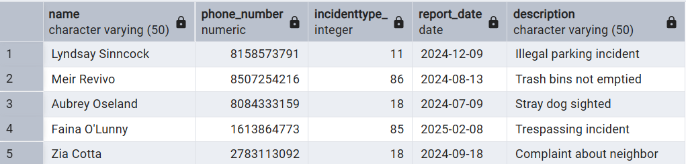{width="5.768055555555556in"
> height="1.3895833333333334in"}

2)  [מספר ההזמנות לפי סוג חדר]{dir="rtl"}

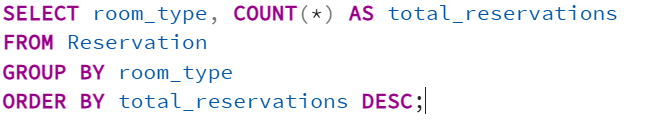{width="5.768055555555556in"
height="1.2180555555555554in"}

{width="4.083903105861768in"
height="2.5628576115485564in"}

3)  [כל המשובים מתחת לדירוג 3 שנכתבו בחודשים שונים]{dir="rtl"}

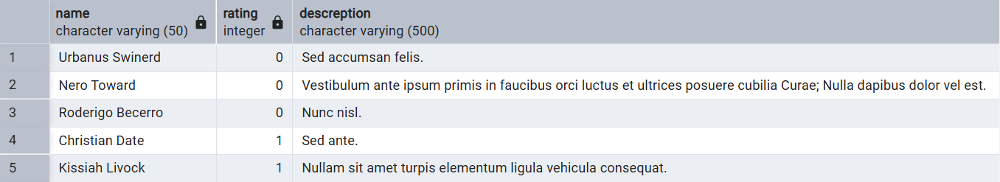{width="5.768055555555556in"
height="1.0506944444444444in"}{width="5.768055555555556in"
height="1.117361111111111in"}

[]{dir="rtl"}

4)  [מספר הלילות שכל אורח שהה במלון]{dir="rtl"}

{width="4.520833333333333in"
height="2.3854166666666665in"}{width="5.768055555555556in"
height="1.1020833333333333in"}

5)  [רשימת אורחים עם מנוי ברמה גבוהה מ7]{dir="rtl"}

{width="5.768055555555556in"
height="1.225in"}

{width="4.815972222222222in"
height="1.8458333333333334in"}

[]{dir="rtl"}

6)  [אורחים שהשאירו פידבק על יותר מהזמנה אחת]{dir="rtl"}

> {width="4.865262467191601in"
> height="1.3231014873140858in"}{width="5.768055555555556in"
> height="1.4222222222222223in"}

7)  {width="4.821531058617673in"
    height="2.723067585301837in"}[תאריכי הדיווחים לפי סוג
    התקרית]{dir="rtl"}

> {width="4.836675415573054in"
> height="2.1359044181977254in"}

8)  [דירוג ממוצע של פידבק לפי רמת המנוי]{dir="rtl"}

> {width="4.399071522309711in"
> height="2.338297244094488in"}

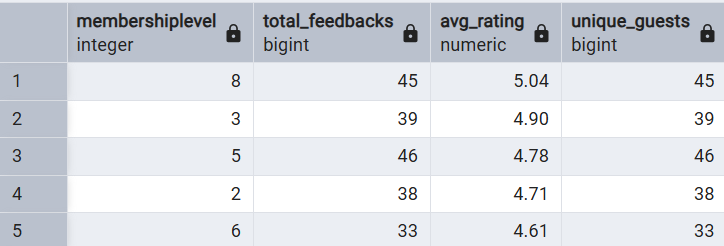{width="4.727272528433946in"
height="1.606111111111111in"}

**Delete:**

1.  [מחיקת כל הפידבקים מתחת לדירוג 2]{dir="rtl"}

> {width="3.021255468066492in"
> height="0.729268372703412in"}
>
> [מסד הנתונים לפני השינוי:]{dir="rtl"}
>
> {width="5.768055555555556in"
> height="0.7326388888888888in"}
>
> [מסד הנתונים לאחר השינוי:]{dir="rtl"}
>
> {width="5.768055555555556in"
> height="0.6243055555555556in"}

2.  [מחיקת מנויים שאין להם נקודות כלל]{dir="rtl"}

> {width="3.771359361329834in"
> height="0.6563418635170604in"}

[מסד הנתונים לפני השינוי:]{dir="rtl"}

{width="5.707620297462817in"
height="1.187351268591426in"}

[מסד הנתונים לאחר השינוי:]{dir="rtl"}

{width="5.768055555555556in"
height="1.1576388888888889in"}

3.  [מחיקת תקריות שנסגרו לפני יותר משנה]{dir="rtl"}

> {width="5.768055555555556in"
> height="2.138888888888889in"}[מסד הנתונים לפני השינוי:]{dir="rtl"}
>
> 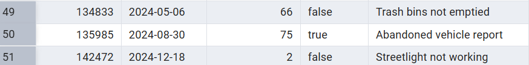{width="5.768055555555556in"
> height="0.7125in"}
>
> [מסד הנתונים לאחר השינוי:]{dir="rtl"}
>
> {width="5.768055555555556in"
> height="0.9145833333333333in"}

**Update:**

1.  [עדכון סטטוס התקריות שגילן מעל חודש לסגורות]{dir="rtl"}

> 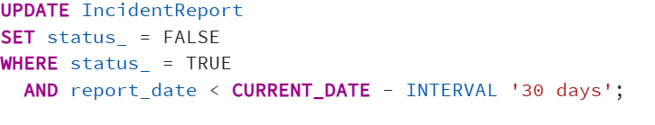{width="5.768055555555556in"
> height="1.1041666666666667in"}

[מסד הנתונים לפני השינוי:]{dir="rtl"}

{width="5.768055555555556in"
height="1.125in"}

[מסד הנתונים לאחר השינוי:]{dir="rtl"}

{width="5.768055555555556in"
height="1.101388888888889in"}

2.  [עדכון דירוג של פידבקים בלי תיאור לדירוג 3]{dir="rtl"}

> {width="4.712377515310586in"
> height="0.8459142607174103in"}
>
> [מסד הנתונים לפני השינוי:]{dir="rtl"}
>
> {width="5.768055555555556in"
> height="0.73125in"}

[מסד הנתונים לאחר השינוי:]{dir="rtl"}

{width="5.768055555555556in"
height="0.7423611111111111in"}

3.  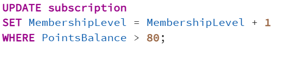{width="5.768055555555556in"
    height="1.2069444444444444in"}[העלאת רמת המנוי לכל מי שיש לו מעל 80
    נקודות]{dir="rtl"}

[מסד הנתונים לפני השינוי:]{dir="rtl"}

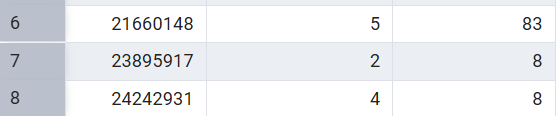{width="5.174471784776903in"
height="1.079623797025372in"}

[מסד הנתונים לאחר השינוי:]{dir="rtl"}

{width="4.965016404199475in"
height="0.9785072178477691in"}

**7) Constraints:**

1.  [חובה להכניס מספר טלפון לאורח]{dir="rtl"}

> 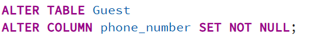{width="5.457650918635171in"
> height="0.7394903762029746in"}
>
> [ניסיון הכנסת נתון שסותר את האילוץ:]{dir="rtl"}
>
> {width="5.768055555555556in"
> height="2.98125in"}

2.  [ברירת מחדל לסטטוס תקרית יהיה \'פתוח\']{dir="rtl"}

> {width="5.082075678040245in"
> height="0.7341830708661418in"}

[ניסיון להכנסת נתונים:]{dir="rtl"}

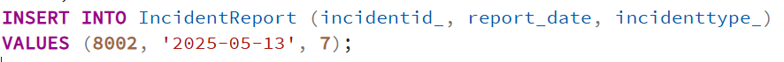{width="5.768055555555556in"
height="0.4625in"}

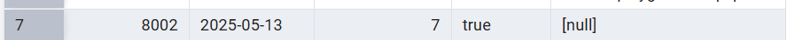{width="5.768055555555556in"
height="0.2986111111111111in"}

3.  [אילוץ שתאריך הכניסה יהיה לפני תאריך היציאה]{dir="rtl"}

> 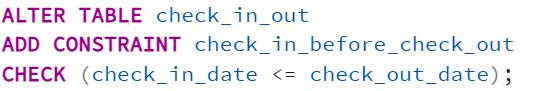{width="4.909091207349081in"
> height="0.831894138232721in"}

[ניסיון להכנסת נתונים וסתירת האילוץ:]{dir="rtl"}

{width="5.768055555555556in"
height="2.9611111111111112in"}

**8) Rollback and Commit:**

{width="5.768055555555556in"
height="2.3652777777777776in"}

[הנתונים לפני הטרנזקציה:]{dir="rtl"}

{width="5.768055555555556in"
height="0.6470592738407699in"}

[השינוי:]{dir="rtl"}

{width="5.768055555555556in"
height="0.6576388888888889in"}

[לאחר]{dir="rtl"} ROLLBACK[:]{dir="rtl"}

{width="5.768055555555556in"
height="0.6395833333333333in"}

{width="4.067361111111111in"
height="2.761111111111111in"}

[]{dir="rtl"}

[המצב לפני השינוי:]{dir="rtl"}

{width="5.768055555555556in"
height="0.6597222222222222in"}

[המצב אחרי השינוי:]{dir="rtl"}

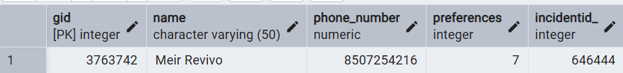{width="5.768055555555556in"
height="0.6763888888888889in"}

[המצב לאחר]{dir="rtl"} commit[:]{dir="rtl"}

{width="5.768055555555556in"
height="0.66875in"}
