**Hotel Management System - README**

**Submitted by:** Ohad Kahlon and Meir Revivo
**System Component:** Guests management.

**Table of Contents**

1. Introduction
1. Entity-Relationship Diagram (ERD)
1. Data Structure Diagram (DSD)
1. Design Decisions
1. Data Input Methods
1. Backup and Restore Procedures
1. Screenshots

**Introduction**

The Hotel Management System is designed to store and manage guest-related data efficiently. It provides functionalities such as guest check-in and check-out, room assignments, billing, and service requests. The goal of the system is to streamline hotel operations and enhance customer service.

**Entity-Relationship Diagram (ERD)**

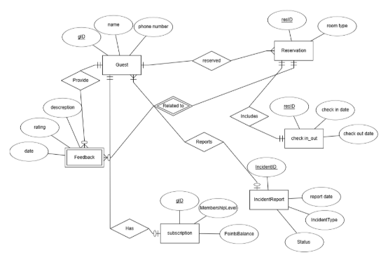

**Data Structure Diagram (DSD)**

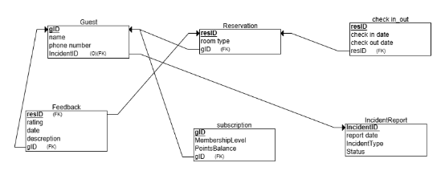

**SQL Scripts**

Provide the following SQL scripts:

- **Create Tables Script** - The SQL script for creating the database tables is available in the repository: 
- **Insert Data Script** - The SQL script for insert data to the database tables is available in the repository:
- **Drop Tables Script** - The SQL script for droping all tables is available in the repository:
- **Select All Data Script** - The SQL script for selectAll tables is available in the repository:

**Data**

**First tool: using [mockaro](https://www.mockaroo.com/)o to create csv file**

**Entering a data to guest table:**

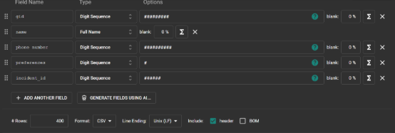

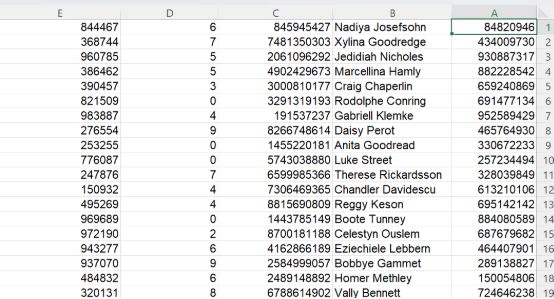

**Second tool: using [generatedata](https://generatedata.com/generator). to create csv file**

**Entering a data to incidentType table:**

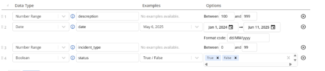 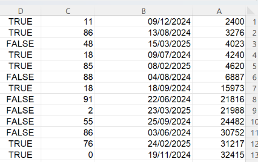

**Third tool: using python to create csv file**

**Part of Python code:**

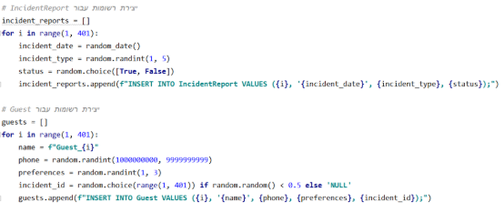

**Sql file made from the python script:**

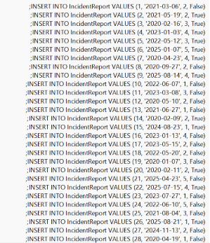

**Backup**

- **backups files are kept with the date of the backup:**

**Queries**

**Select:**

1) רשימת האורחים שהיו להם תקריות פתוחות, ופרטי התקרית ביחד עם פרטי האורח

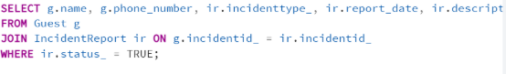

1) מספר ההזמנות לפי סוג חדר

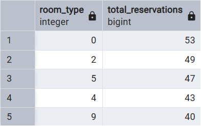

1) כל המשובים מתחת לדירוג 3 שנכתבו בחודשים שונים

   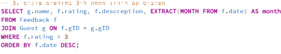

1) מספר הלילות שכל אורח שהה במלון

   

1) רשימת אורחים עם מנוי ברמה גבוהה מ7

   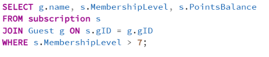

1) אורחים שהשאירו פידבק על יותר מהזמנה אחת

1) תאריכי הדיווחים לפי סוג התקרית

1) דירוג ממוצע של פידבק לפי רמת המנוי

**Delete:**

- מחיקת כל הפידבקים מתחת לדירוג 2

מסד הנתונים לפני השינוי:

מסד הנתונים לאחר השינוי:

- מחיקת מנויים שאין להם נקודות כלל

  

מסד הנתונים לפני השינוי:

מסד הנתונים לאחר השינוי:

- מחיקת תקריות שנסגרו לפני יותר משנה

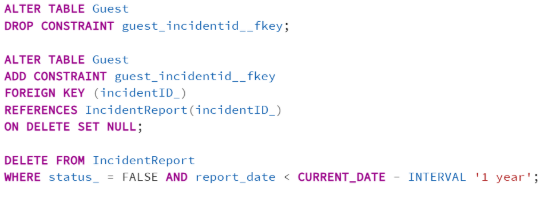מסד הנתונים לפני השינוי:

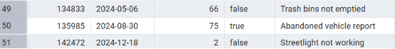

מסד הנתונים לאחר השינוי:

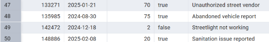

**Update:**

- עדכון סטטוס התקריות שגילן מעל חודש לסגורות

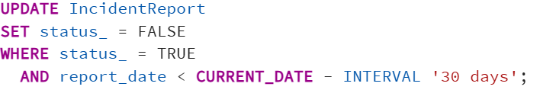

מסד הנתונים לפני השינוי:

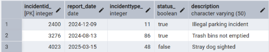

מסד הנתונים לאחר השינוי:

- ` `עדכון דירוג של פידבקים בלי תיאור לדירוג 3

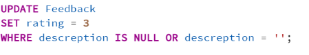

מסד הנתונים לפני השינוי:

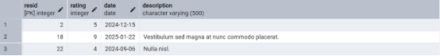

מסד הנתונים לאחר השינוי:

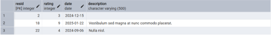

- העלאת רמת המנוי לכל מי שיש לו מעל 80 נקודות

מסד הנתונים לפני השינוי:

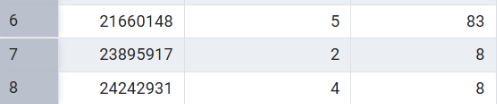

מסד הנתונים לאחר השינוי:

**Constraints:**

- חובה להכניס מספר טלפון לאורח

ניסיון הכנסת נתון שסותר את האילוץ:

- ברירת מחדל לסטטוס תקרית יהיה 'פתוח'

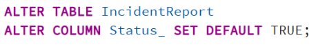

ניסיון להכנסת נתונים:

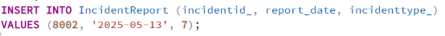

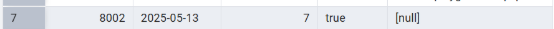

- ` `אילוץ שתאריך הכניסה יהיה לפני תאריך היציאה

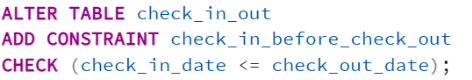

ניסיון להכנסת נתונים וסתירת האילוץ:

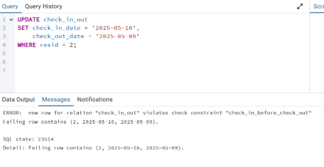

**Rollback and Commit:**

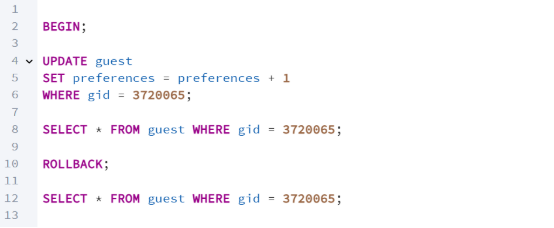

הנתונים לפני הטרנזקציה:

![ref1]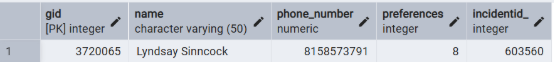

השינוי:

![ref1]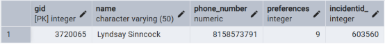

לאחר ROLLBACK: 

![ref1]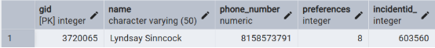

המצב לפני השינוי:

![ref1]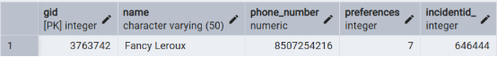

המצב אחרי השינוי:

![ref1]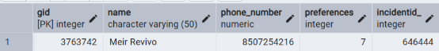

המצב לאחר commit:

![ref1]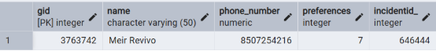

[ref1]: images/Aspose.Words.a5b42203-2a7d-45ed-bad4-b466be016fba.053.png
