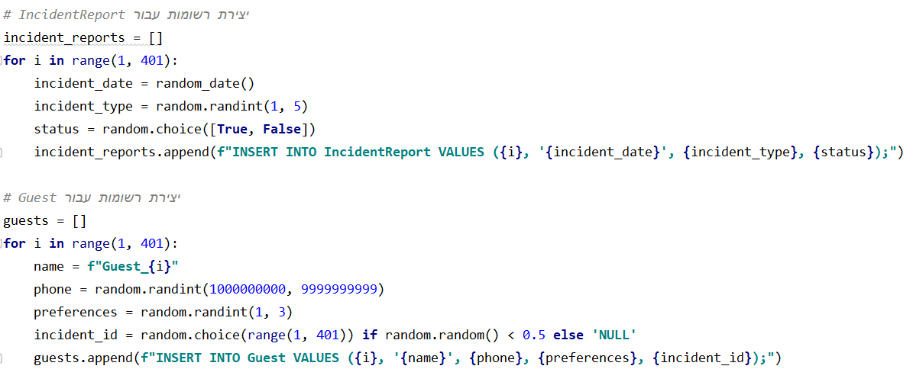
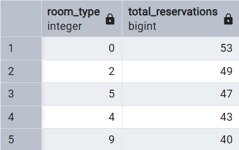
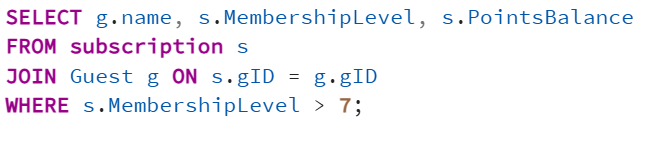
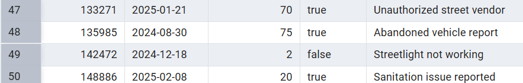
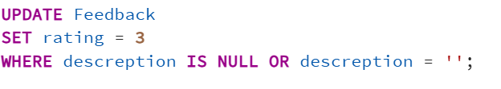
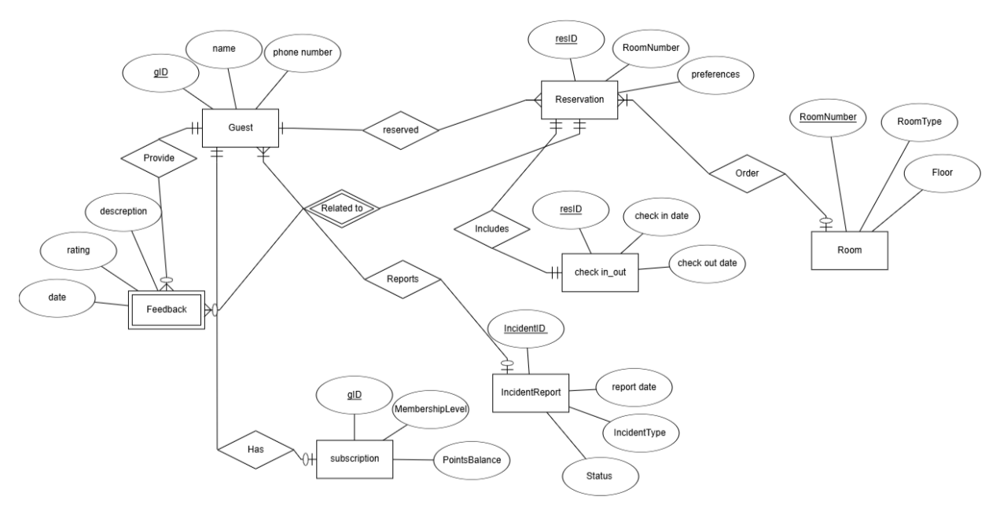
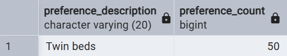

**Hotel Management System - README**

**Submitted by:** Ohad Kahlon and Meir Revivo\
**System Component:** Guests management.

**Table of Contents**

1.  Introduction

2.  Entity-Relationship Diagram (ERD)

3.  Data Structure Diagram (DSD)

4.  Data Input Methods

5.  Backup and Restore Procedures

6.  Queries

7.  Constraints

8.  Rollback and Commit

```{=html}
<!-- -->
```
1)  **Introduction**

The Hotel Management System is designed to store and manage
guest-related data efficiently. It provides functionalities such as
guest check-in and check-out, room assignments, billing, and service
requests. The goal of the system is to streamline hotel operations and
enhance customer service.

2)  **Entity-Relationship Diagram (ERD)**

{width="5.768055555555556in"
height="3.8916666666666666in"}

3)  **Data Structure Diagram (DSD)**

{width="5.768055555555556in"
height="2.2708333333333335in"}

4)  **Data input methods**

> **First tool: using [mockaro](https://www.mockaroo.com/)o to create
> csv file**
>
> **Entering a data to guest table:**
>
> {width="5.768055555555556in"
> height="1.9444444444444444in"}
>
> {width="5.768055555555556in"
> height="3.109027777777778in"}
>
> **Second tool:
> using [generatedata](https://generatedata.com/generator). to create
> csv file**
>
> **Entering a data to incidentType table:**
>
> {width="5.768055555555556in"
> height="1.2590277777777779in"}
> {width="4.46696741032371in"
> height="2.807853237095363in"}
>
> **Third tool: using python to create csv file**
>
> **Part of Python code:**
>
> {width="5.768055555555556in"
> height="2.4180555555555556in"}
>
> **Sql file made from the python script:**
>
> {width="3.1223600174978126in"
> height="3.62834208223972in"}

5)  **Backup**

-   **backups files are kept with the date of the backup:**

> {width="5.768055555555556in"
> height="0.22291666666666668in"}

6)  **Queries**

> **Select:**

1)  [רשימת האורחים שהיו להם תקריות פתוחות, ופרטי התקרית ביחד עם פרטי
    האורח]{dir="rtl"}

> {width="5.768055555555556in"
> height="0.8423611111111111in"}
>
> {width="5.768055555555556in"
> height="1.3895833333333334in"}

2)  [מספר ההזמנות לפי סוג חדר]{dir="rtl"}

{width="5.768055555555556in"
height="1.2180555555555554in"}

{width="4.083903105861768in"
height="2.5628576115485564in"}

3)  [כל המשובים מתחת לדירוג 3 שנכתבו בחודשים שונים]{dir="rtl"}

{width="5.768055555555556in"
height="1.0506944444444444in"}{width="5.768055555555556in"
height="1.117361111111111in"}

[]{dir="rtl"}

4)  [מספר הלילות שכל אורח שהה במלון]{dir="rtl"}

{width="4.520833333333333in"
height="2.3854166666666665in"}{width="5.768055555555556in"
height="1.1020833333333333in"}

5)  [רשימת אורחים עם מנוי ברמה גבוהה מ7]{dir="rtl"}

{width="5.768055555555556in"
height="1.225in"}

{width="4.815972222222222in"
height="1.8458333333333334in"}

[]{dir="rtl"}

6)  [אורחים שהשאירו פידבק על יותר מהזמנה אחת]{dir="rtl"}

> {width="4.865262467191601in"
> height="1.3231014873140858in"}{width="5.768055555555556in"
> height="1.4222222222222223in"}

7)  {width="4.821531058617673in"
    height="2.723067585301837in"}[תאריכי הדיווחים לפי סוג
    התקרית]{dir="rtl"}

> {width="4.836675415573054in"
> height="2.1359044181977254in"}

8)  [דירוג ממוצע של פידבק לפי רמת המנוי]{dir="rtl"}

> {width="4.399071522309711in"
> height="2.338297244094488in"}

{width="4.727272528433946in"
height="1.606111111111111in"}

**Delete:**

1.  [מחיקת כל הפידבקים מתחת לדירוג 2]{dir="rtl"}

> {width="3.021255468066492in"
> height="0.729268372703412in"}
>
> [מסד הנתונים לפני השינוי:]{dir="rtl"}
>
> {width="5.768055555555556in"
> height="0.7326388888888888in"}
>
> [מסד הנתונים לאחר השינוי:]{dir="rtl"}
>
> {width="5.768055555555556in"
> height="0.6243055555555556in"}

2.  [מחיקת מנויים שאין להם נקודות כלל]{dir="rtl"}

> {width="3.771359361329834in"
> height="0.6563418635170604in"}

[מסד הנתונים לפני השינוי:]{dir="rtl"}

{width="5.707620297462817in"
height="1.187351268591426in"}

[מסד הנתונים לאחר השינוי:]{dir="rtl"}

{width="5.768055555555556in"
height="1.1576388888888889in"}

3.  [מחיקת תקריות שנסגרו לפני יותר משנה]{dir="rtl"}

> {width="5.768055555555556in"
> height="2.138888888888889in"}[מסד הנתונים לפני השינוי:]{dir="rtl"}
>
> {width="5.768055555555556in"
> height="0.7125in"}
>
> [מסד הנתונים לאחר השינוי:]{dir="rtl"}
>
> {width="5.768055555555556in"
> height="0.9145833333333333in"}

**Update:**

1.  [עדכון סטטוס התקריות שגילן מעל חודש לסגורות]{dir="rtl"}

> {width="5.768055555555556in"
> height="1.1041666666666667in"}

[מסד הנתונים לפני השינוי:]{dir="rtl"}

{width="5.768055555555556in"
height="1.125in"}

[מסד הנתונים לאחר השינוי:]{dir="rtl"}

{width="5.768055555555556in"
height="1.101388888888889in"}

2.  [עדכון דירוג של פידבקים בלי תיאור לדירוג 3]{dir="rtl"}

> {width="4.712377515310586in"
> height="0.8459142607174103in"}
>
> [מסד הנתונים לפני השינוי:]{dir="rtl"}
>
> {width="5.768055555555556in"
> height="0.73125in"}

[מסד הנתונים לאחר השינוי:]{dir="rtl"}

{width="5.768055555555556in"
height="0.7423611111111111in"}

3.  {width="5.768055555555556in"
    height="1.2069444444444444in"}[העלאת רמת המנוי לכל מי שיש לו מעל 80
    נקודות]{dir="rtl"}

[מסד הנתונים לפני השינוי:]{dir="rtl"}

{width="5.174471784776903in"
height="1.079623797025372in"}

[מסד הנתונים לאחר השינוי:]{dir="rtl"}

{width="4.965016404199475in"
height="0.9785072178477691in"}

7)  **Constraints:**

    1.  [חובה להכניס מספר טלפון לאורח]{dir="rtl"}

> {width="5.457650918635171in"
> height="0.7394903762029746in"}
>
> [ניסיון הכנסת נתון שסותר את האילוץ:]{dir="rtl"}
>
> {width="5.768055555555556in"
> height="2.98125in"}

2.  [ברירת מחדל לסטטוס תקרית יהיה \'פתוח\']{dir="rtl"}

> {width="5.082075678040245in"
> height="0.7341830708661418in"}

[ניסיון להכנסת נתונים:]{dir="rtl"}

{width="5.768055555555556in"
height="0.4625in"}

{width="5.768055555555556in"
height="0.2986111111111111in"}

3.  [אילוץ שתאריך הכניסה יהיה לפני תאריך היציאה]{dir="rtl"}

> {width="4.909091207349081in"
> height="0.831894138232721in"}

[ניסיון להכנסת נתונים וסתירת האילוץ:]{dir="rtl"}

{width="5.768055555555556in"
height="2.9611111111111112in"}

8)  **Rollback and Commit:**

{width="5.768055555555556in"
height="2.3652777777777776in"}

[הנתונים לפני הטרנזקציה:]{dir="rtl"}

{width="5.768055555555556in"
height="0.6470592738407699in"}

[השינוי:]{dir="rtl"}

{width="5.768055555555556in"
height="0.6576388888888889in"}

[לאחר]{dir="rtl"} ROLLBACK[:]{dir="rtl"}

{width="5.768055555555556in"
height="0.6395833333333333in"}

{width="4.067361111111111in"
height="2.761111111111111in"}

[]{dir="rtl"}

[המצב לפני השינוי:]{dir="rtl"}

{width="5.768055555555556in"
height="0.6597222222222222in"}

[המצב אחרי השינוי:]{dir="rtl"}

{width="5.768055555555556in"
height="0.6763888888888889in"}

[המצב לאחר]{dir="rtl"} commit[:]{dir="rtl"}

{width="5.768055555555556in"
height="0.66875in"}

**[[שלב 3 -- אינטגרציה:]{.underline}]{dir="rtl"}**

[קיבלנו מסד נתונים של חדרים והזמנות. טבלת החדרים מקשרת בין מספר חדר לסוג
ולפרטים שלו, וטבלת ההזמנות (כמו טבלת ההזמנות במסד נתונים שלנו), מקשרת
בין מספר הזמנה למספר החדר המוזמן.]{dir="rtl"}

[במסד נתונים המשותף, נאחד את טבלאות ההזמנות של המסד המקורי ושל המסד
החדש. במסד החדש יש ערך]{dir="rtl"} RoomNumber [בתוך טבלת ההזמנות, בעוד
במסד שלנו יש ערך]{dir="rtl"} RoomType[. מכיוון שנוספת במסד המאוחד
טבלת]{dir="rtl"} Room [שמקשרת בין מסר החדר לבין הסוג שלו, נמחק את
הפרמטר]{dir="rtl"} RoomType [מטבלת ההזמנות לטובת הערך]{dir="rtl"}
RoomNumber[.]{dir="rtl"}

[למסדר המשותף נוסיף את טבלת]{dir="rtl"} Room [מהמסד החדש, ונקשר אותה
לטבלת ההזמנות הקיימת.]{dir="rtl"}

[תרשים]{dir="rtl"} ERD [של מסד הנתונים השני:]{dir="rtl"}

{width="5.274022309711286in"
height="1.6518985126859143in"}

[תרשים]{dir="rtl"} DSD [של מסד הנתונים השני:]{dir="rtl"}

{width="5.33330271216098in"
height="1.3788232720909885in"}

{width="5.768055555555556in"
height="2.977777777777778in"}[תרשים]{dir="rtl"} ERD [של מסד הנתונים
המאוחד:]{dir="rtl"}

[תרשים]{dir="rtl"} DSD [של מסד הנתונים המאוחד:]{dir="rtl"}

{width="5.768055555555556in"
height="2.7104166666666667in"}

[[תיאור שינוי מסד הנתונים כולל החלטות ופקודות:]{.underline}]{dir="rtl"}

[שלב א: הוספת הטבלה]{dir="rtl"} Room [למסד הנתונים הקיים.]{dir="rtl"}

{width="5.768055555555556in"
height="1.7in"}

[שלב ב: נוסיף לטבלת ההזמנות את העמודה]{dir="rtl"}
RoomNumber[:]{dir="rtl"}

{width="3.4331550743657044in"
height="0.7055555555555556in"}

[שלב ג: נקשר את טבלת]{dir="rtl"} Reservation [לטבלת]{dir="rtl"}
Room[:]{dir="rtl"}

{width="4.663101487314086in"
height="1.21040791776028in"}

[שלב ד: מחיקת העמודה]{dir="rtl"} room_type [מטבלת ההזמנות:]{dir="rtl"}

{width="4.063290682414698in"
height="1.2436909448818898in"}

[שלב ה: נעתיק את נתוני]{dir="rtl"} roomNumber [מטבלת]{dir="rtl"} room
[לטבלת]{dir="rtl"} reservation[:]{dir="rtl"}

{width="5.768055555555556in"
height="2.620833333333333in"}

**[[יצירת מבטים:]{.underline}]{dir="rtl"}**

[[מבט 1:]{.underline} מבט של ניהול/תפעול חדרים -- איזה חדרים הוזמנו וכמה
פעמים, כולל סוג החדר והקומה.]{dir="rtl"}

{width="5.768055555555556in"
height="2.2895833333333333in"}

{width="4.381979440069991in"
height="2.9253641732283464in"}[[נתונים מהמבט:]{.underline}]{dir="rtl"}

[[יצירת שתי שאילתות על המבט:]{.underline}]{dir="rtl"}

1.  [הצגת כל החדרים עם 0 הזמנות]{dir="rtl"}

2.  [הצגת סכום ההזמנות לפי קומה, ממוין על פי מספרי הקומות]{dir="rtl"}

{width="5.768055555555556in"
height="2.285416666666667in"}

[נתונים מהשאילתות:]{dir="rtl"}

1.  []{dir="rtl"}

> {width="5.768055555555556in"
> height="0.7784809711286089in"}

[(אין חדרים עם 0 הזמנות בנתונים שלנו)]{dir="rtl"}

2.  {width="1.8504582239720035in"
    height="2.8544302274715663in"}

[החלטנו שצריך להוסיף גם טבלת]{dir="rtl"} preferences [שתקשר בין מספר
ההעדפה (בטבלת ההזמנות) לתיאור המילולי שלה.]{dir="rtl"}

{width="4.905063429571303in"
height="1.4834481627296587in"}

[נקשר בינה לבין טבלת]{dir="rtl"} reservation[:]{dir="rtl"}

{width="5.278480971128609in"
height="1.722211286089239in"}

[[מבט 2:]{.underline} מבט של ניתוח העדפות אורחים -- מה ההעדפות שנבחרו,
וכמה הזמנות בחרו כל אחת.]{dir="rtl"}

{width="5.768055555555556in"
height="2.803472222222222in"}

{width="2.556961942257218in"
height="2.302833552055993in"}

[[יצירת שתי שאילתות על המבט:]{.underline}]{dir="rtl"}

1.  [ההעדפה הכי פופולרית]{dir="rtl"}

2.  {width="5.768055555555556in"
    height="2.04375in"}[כל ההעדפות עם יותר מ־30 הזמנות]{dir="rtl"}

```{=html}
<!-- -->
```
1)  []{dir="rtl"}

> {width="4.44936789151356in"
> height="0.8731539807524059in"}

2)  []{dir="rtl"}

> {width="4.175557742782153in"
> height="3.107595144356955in"}
